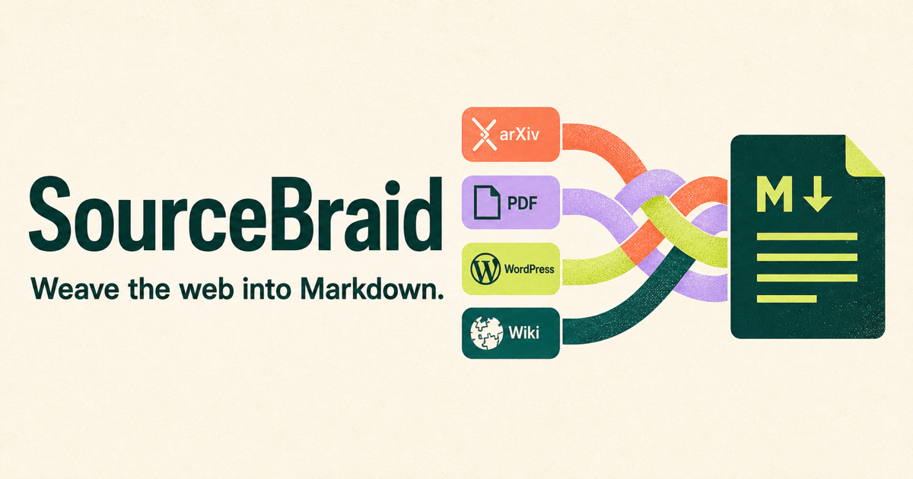
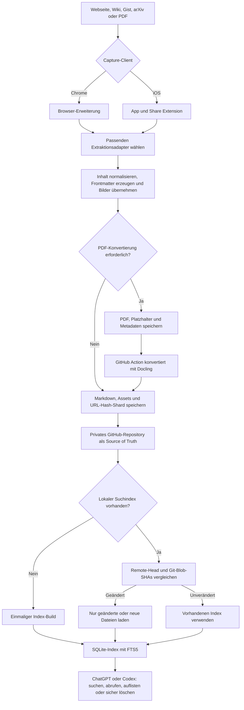

# SourceBraid

**SourceBraid — Weave the web into Markdown.**

[Read this documentation in English](README.md)



[SourceBraid](https://sourcebraid.com) speichert Artikel, wissenschaftliche Veröffentlichungen, Wiki-Seiten, GitHub Gists und PDF-Dokumente als dauerhaft lesbares Markdown in einem privaten GitHub-Repository. Metadaten landen im YAML-Frontmatter, relevante Bilder als lokale Repository-Assets und alle Einträge zusätzlich in einem durchsuchbaren Index.

## So funktioniert SourceBraid

SourceBraid besteht aus Capture-Clients, dem GitHub-Repository als dauerhafter Datenquelle und einem universellen ChatGPT-/Codex-Plugin für Suche und Verwaltung. Es gibt keinen zentralen SourceBraid-Server: Die Chrome-Erweiterung beziehungsweise die iOS-App liest die Quelle, bereitet sie auf und schreibt das Ergebnis direkt in das konfigurierte Repository. Der lokale SQLite-Index ist nur ein jederzeit neu aufbaubarer Such-Cache; maßgeblich bleiben immer die Markdown-Dateien und die Git-Historie auf GitHub.



Der Ablauf im Einzelnen:

1. **Erfassen:** Eine Person startet SourceBraid auf der geöffneten Seite oder teilt einen Inhalt aus iOS. Tags und eigene Notizen können bereits beim Speichern ergänzt werden.
2. **Extrahieren:** SourceBraid wählt den hochwertigsten verfügbaren Adapter. Strukturierte Quellen wie arXiv, Azure DevOps, Gists oder native Markdown-Endpunkte haben Vorrang vor der allgemeinen DOM-Auslese.
3. **Aufbereiten:** Der Inhalt wird in portables Markdown umgewandelt. SourceBraid ergänzt YAML-Frontmatter, macht relative Quell-Links eindeutig und speichert relevante Bilder neben dem Dokument, damit der Clip auch ohne die ursprüngliche Webseite lesbar bleibt.
4. **Versioniert speichern:** Dokument, Assets und Metadateneintrag werden über die GitHub Contents API geschrieben. Der Metadateneintrag landet anhand des URL-Hashes in einem von bis zu 256 JSONL-Shards. Git-Commits machen jede Änderung nachvollziehbar und wiederherstellbar.
5. **PDFs nachbearbeiten:** Falls keine geeignete HTML-Fassung existiert, bleibt das Original-PDF im Repository. Eine GitHub Action erzeugt mit Docling das endgültige Markdown, extrahiert Abbildungen und ersetzt den zunächst angelegten Platzhalter.
6. **Indexieren:** Beim ersten Einsatz baut das Codex-Plugin aus dem Repository einen lokalen SQLite-FTS5-Index auf. Spätere Aktualisierungen vergleichen den gespeicherten Commit und die Git-Blob-SHAs; dadurch werden nur neue, geänderte oder gelöschte Dateien verarbeitet.
7. **Verwenden:** ChatGPT oder Codex durchsucht normalerweise den lokalen Index, kann Treffer vollständig abrufen und unterstützt eine abgesicherte Löschung mit Vorschau und ausdrücklicher Bestätigung. Ist GitHub vorübergehend nicht erreichbar, bleibt der zuletzt synchronisierte Index lesbar.

Die Trennung zwischen GitHub-Archiv und lokalem Such-Cache ist für größere Sammlungen entscheidend: Auch bei vielen Tausend Dokumenten muss eine normale Suche nicht alle Markdown-Dateien nacheinander öffnen. Ein vollständiger Durchlauf ist nur für den ersten Aufbau, einen ausdrücklich angeforderten Rebuild oder eine Reparatur nach beschädigtem Index nötig.

## Unterstützte Formate und Konvertierung

| Quelle oder Format | Bevorzugte Extraktion | Ergebnis in Markdown | Bilder und Anlagen | Fallback |
| --- | --- | --- | --- | --- |
| **arXiv-Paper** | Experimentelle arXiv-HTML-Version des vollständigen Papers | Gliederung, Fließtext, Tabellen, Zitate und LaTeX-Formeln; Autoren, arXiv-ID/-Version, DOI, Fachgebiete und Journalreferenz im Frontmatter | Abbildungen werden in den Asset-Ordner kopiert und relativ verlinkt | Wenn kein arXiv-HTML verfügbar ist: PDF im Hintergrund laden und mit Docling konvertieren |
| **PDF über HTTP(S) oder lokale Datei** | Original-PDF plus asynchroner Docling-Workflow in GitHub Actions | Lesereihenfolge, Tabellen, OCR-Text und referenzierte Abbildungen; zunächst Status `pending`, danach fertiges Markdown | Original bleibt als `source.pdf` erhalten; extrahierte Abbildungen liegen daneben | Lokale PDFs benötigen in Chrome **Zugriff auf Datei-URLs zulassen**; passwortgeschützte oder nur per angemeldeter Web-Sitzung erreichbare PDFs werden nicht unterstützt |
| **Azure DevOps Wiki** | Authentifizierte Wiki-REST-API liefert das Quell-Markdown | Azure-Makros werden bereinigt, Mermaid bleibt als `mermaid`-Codeblock erhalten, interne Wiki-Links werden absolut | Geschützte Attachments werden über den noch geöffneten, angemeldeten Tab geladen und lokal abgelegt | Gerenderter `.markdown-content`-Bereich, falls die API nicht erreichbar ist |
| **GitHub Gist** | GitHub Gist API, bei privaten Gists mit dem konfigurierten Token | Einzelne Markdown-Datei direkt; mehrere Dateien als Abschnitte; Quellcode in sprachlich markierten Codeblöcken | Öffentliche Bilder direkt, geschützte GitHub-Bilder über den angemeldeten Gist-Tab | Die Revision einer revisionsspezifischen URL bleibt erhalten |
| **Natives Markdown** | HTTP-Antwort auf `Accept: text/markdown`, z. B. bei Hashnode oder entsprechend konfigurierten Cloudflare-Seiten | Quell-Frontmatter und doppeltes H1 werden entfernt; relative Links werden absolut | Relevante Bilder werden lokal gespeichert und relativ verlinkt | Danach greifen die spezifischen APIs oder die DOM-Extraktion |
| **WordPress** | WordPress-REST-Endpunkt aus den Seitenmetadaten | Artikelinhalt wird aus der strukturierten API-Antwort konvertiert | Relevante Artikelbilder werden lokal gespeichert | Sichtbarer Seiteninhalt |
| **Forem / DEV** | Forem API mit Quell-Markdown | Markdown wird normalisiert und ohne Seiten-Chrome gespeichert | Relevante Bilder werden lokal gespeichert | Sichtbarer Seiteninhalt |
| **Ghost** | Konfigurierte Ghost Content API | Strukturierter Post-Inhalt; die kanonische URL wird vor der Übernahme geprüft | Relevante Bilder werden lokal gespeichert | Sichtbarer Seiteninhalt |
| **Blogger** | Blogger API anhand erkannter Blog- und Post-IDs | Strukturierter Artikelinhalt | Relevante Bilder werden lokal gespeichert | Sichtbarer Seiteninhalt |
| **JSON Feed, RSS oder Atom** | Im HTML angekündigter Feed | Vollständiger Feed-Inhalt, sofern vorhanden | Relevante Bilder werden lokal gespeichert | Sichtbarer Seiteninhalt |
| **Allgemeine HTML-Seite** | Sichtbarer DOM, bevorzugt `article`, `main` oder `[role="main"]` | Überschriften, Absätze, Links, Listen, Zitate, Codeblöcke und Tabellen | Inhaltlich relevante Bilder werden lokal gespeichert | `body` als letzte Rückfallstufe |

### Reihenfolge der Erkennung

SourceBraid verwendet immer die inhaltlich hochwertigste verfügbare Quelle. Bei HTML-Seiten werden die Adapter in dieser Reihenfolge geprüft:

1. arXiv-HTML
2. Azure DevOps Wiki
3. GitHub Gist
4. natives Markdown
5. WordPress REST
6. Forem / DEV API
7. Ghost Content API
8. Blogger API
9. JSON Feed, RSS oder Atom
10. sichtbarer DOM

Die erste passende und validierte Quelle gewinnt. Anschließend normalisiert SourceBraid das Markdown, lädt Bilder herunter, schreibt das YAML-Frontmatter und aktualisiert den Index.

## Ablagestruktur

Markdown-Dateien werden über die GitHub Contents API gespeichert:

```text
web-clips/YYYY/MM/YYYY-MM-DD-domain-titel-urlhash.md
```

Die zugehörigen Assets liegen unter:

```text
web-clips/YYYY/MM/assets/YYYY-MM-DD-domain-titel-urlhash/
```

Links auf gespeicherte Bilder werden im Markdown relativ zu diesem Asset-Ordner geschrieben. Für PDFs liegt dort zusätzlich das Original als `source.pdf`.

SourceBraid pflegt außerdem einen nach URL-Hash geshardeten Metadatenindex:

```text
web-clips/index/00.jsonl
...
web-clips/index/ff.jsonl
```

Dieselbe URL landet immer im selben Shard. Dadurch muss beim Speichern nicht der Metadatenbestand aller Clips neu geschrieben werden. Bestehende Archive mit `web-clips/index.jsonl` bleiben kompatibel und können über das Codex-Plugin atomar migriert werden. Jede Indexzeile enthält unter anderem Titel, Quell-URL, Repository-Pfad, Ablagedatum, optionale Veröffentlichungs- und Änderungsdaten, Tags, Quellentyp, Extraktionsmethode, Erfassungszeitpunkt und gespeicherte Bildpfade. `date` und der Pfad `YYYY/MM` verwenden das lokale Ablagedatum; das Veröffentlichungsdatum der Quelle bleibt separat als `published` erhalten.

## Wissenschaftliche Quellen

### arXiv direkt als Markdown

Eine arXiv-Abstract-Seite wie `https://arxiv.org/abs/2311.02462` kann direkt gespeichert werden. SourceBraid lädt bevorzugt die experimentelle HTML-Ausgabe des vollständigen Papers, konvertiert sie in Markdown und übernimmt wissenschaftliche Metadaten. Das PDF muss dafür weder manuell heruntergeladen noch in Chrome geöffnet werden.

Existiert keine HTML-Ausgabe, lädt die Erweiterung das PDF im Hintergrund in das Repository. Der Docling-Workflow übernimmt danach automatisch die Konvertierung.

### Allgemeine PDFs

SourceBraid unterstützt sowohl PDF-URLs über HTTP(S) als auch lokale, in Chrome geöffnete `.pdf`-Dateien. Für lokale Dateien muss unter `chrome://extensions` in den Details von SourceBraid einmalig **Zugriff auf Datei-URLs zulassen** aktiviert sein. Ist die Berechtigung nicht gesetzt, zeigt die Erweiterung eine konkrete Anleitung an und legt keinen leeren HTML-Clip an.

Ein PDF-Tab wird zunächst so abgelegt:

```text
web-clips/YYYY/MM/assets/CLIP-SLUG/source.pdf
```

Die Erweiterung erstellt vorab einen ausstehenden Markdown-Eintrag und einen Indexdatensatz. Der abschließende PDF-Commit startet `.github/workflows/convert-pdfs.yml`. Der Workflow:

1. installiert Docling auf einem GitHub-Runner,
2. extrahiert Lesereihenfolge, Tabellen, OCR-Text und Abbildungen,
3. ersetzt das ausstehende Markdown unter Beibehaltung von Notizen und Frontmatter,
4. markiert den passenden Indexeintrag als abgeschlossen und
5. behält das Original-PDF neben den extrahierten Assets.

GitHub Actions benötigt Schreibzugriff auf Repository-Inhalte. Der Workflow hat ein Zeitlimit von 45 Minuten; einzelne PDFs sind wegen der Browser- und GitHub-API-Speichergrenzen auf 25 MB begrenzt. Eine erneute Konvertierung ist unter **Actions → Convert PDFs to Markdown → Run workflow** möglich.

Wenn während einer laufenden Konvertierung weitere Clips auf demselben Branch gespeichert werden, aktualisiert der Workflow seinen Branch vor dem Push erneut und wiederholt einen abgelehnten Push bis zu fünfmal. Dadurch gehen parallele SourceBraid-Uploads nicht durch einen kurzzeitigen Git-Ref-Konflikt verloren.

## Wikis und Gists mit Bildern

### Azure DevOps Wiki

SourceBraid ruft das Quell-Markdown über die authentifizierte Azure-DevOps-Wiki-API ab. Falls dies nicht möglich ist, wird ausschließlich der gerenderte Bereich `.markdown-content` konvertiert – nicht Navigation, Kopfzeile oder sonstige Azure-DevOps-Oberfläche.

Da Attachment-URLs die angemeldete Browser-Sitzung benötigen können, lädt SourceBraid die Bilder nacheinander über den geöffneten Quell-Tab, speichert sie im Asset-Ordner und ersetzt die URLs durch relative Repository-Pfade. Der Quell-Tab muss deshalb bis zum Abschluss des Speicherns geöffnet bleiben. Im Frontmatter werden Organisation, Projekt, Wiki-ID, Seiten-ID, Seitenpfad und – soweit verfügbar – Revision festgehalten.

### GitHub Gists

Bei einem Gist wird eine einzelne Markdown-Datei direkt als Dokumentinhalt gespeichert. Mehrdatei-Gists werden zu einem Dokument mit einem Abschnitt je Dateiname zusammengeführt; Nicht-Markdown-Dateien bleiben als sprachlich markierte Codeblöcke erhalten.

Öffentliche Gists funktionieren anonym. Für private Gists verwendet SourceBraid zusätzlich den konfigurierten GitHub-Token, sofern dieser Leserechte für Gists besitzt. GitHub-gehostete Benutzerbilder können über den weiterhin geöffneten, angemeldeten Gist-Tab geladen werden.

## Installation und Verwendung

1. `chrome://extensions` öffnen.
2. **Entwicklermodus** aktivieren.
3. **Entpackte Erweiterung laden** auswählen.
4. Diesen Ordner auswählen.
5. Eine unterstützte Quelle öffnen und auf das **SourceBraid**-Symbol klicken.
6. GitHub-Repository konfigurieren, optional Tags oder Notizen ergänzen und **Save to GitHub** wählen.

Nach der ersten Einrichtung bleiben die GitHub-Einstellungen hinter dem Einstellungssymbol im Popup verborgen. Scheitert nur der GitHub-Upload nach einer erfolgreichen Extraktion, steht im Popup **Download Fallback** zur Verfügung.

## GitHub-Token

Empfohlen wird ein Fine-grained Personal Access Token, der auf genau ein privates Repository beschränkt ist:

```text
Contents: Read and write
Workflows: Read and write
```

`Workflows` ist nur für die PDF-Unterstützung erforderlich. Beim ersten PDF-Upload installiert SourceBraid den mitgelieferten Docling-Workflow, das Konvertierungsskript und die Requirements-Datei, sofern diese Pfade noch nicht existieren. Bestehende Dateien werden nicht überschrieben. Der Token wird lokal im Chrome-Erweiterungsspeicher abgelegt.

Optionale API-Einstellungen:

- Ghost Content API: Basis-URL, zum Beispiel `https://example.com/ghost/api/content`, plus browsergeeigneter Content-API-Key
- Blogger: optionaler Google API Key; öffentliche Posts benötigen kein OAuth, anonyme API-Aufrufe normalerweise aber einen Key für das Kontingent

## SourceBraid in ChatGPT und Codex

Über **Export Plugin Config** kann die Datei `sourcebraid-config.json` heruntergeladen werden. Für das SourceBraid-Codex-Plugin wird sie hier abgelegt:

```text
~/.config/sourcebraid/config.json
```

Alternativ lässt sich das Plugin im Terminal konfigurieren:

```bash
python3 codex-plugin/sourcebraid/scripts/sourcebraid.py config --repo-slug OWNER/REPO --branch main --root-folder web-clips
```

Das versionierte Plugin liegt unter `codex-plugin/sourcebraid`. Es verwendet einen lokalen SQLite-FTS5-Index, lädt bei Aktualisierungen nur anhand der Git-Blob-SHAs geänderte Dateien und unterstützt Suche, Abruf sowie eine abgesicherte Löschvorschau:

```bash
python3 codex-plugin/sourcebraid/scripts/sourcebraid.py index build
python3 codex-plugin/sourcebraid/scripts/sourcebraid.py index update --max-age 900
python3 codex-plugin/sourcebraid/scripts/sourcebraid.py index verify
python3 codex-plugin/sourcebraid/scripts/sourcebraid.py search "dynamic agents" --tag ai
python3 codex-plugin/sourcebraid/scripts/sourcebraid.py list "dynamic agents" --refresh
python3 codex-plugin/sourcebraid/scripts/sourcebraid.py plan-delete --path "web-clips/2026/07/example.md" --json
```

Der Index liegt pro Repository und Branch unter `~/.cache/sourcebraid/.../search.sqlite3` und wird nicht in Git gespeichert. Eine Suche prüft höchstens alle 15 Minuten, ob sich der Remote-Head geändert hat; bei einem Netzfehler bleibt der lokale Index nutzbar. `search --scan` steht als ausdrücklicher `rg`-Fallback zur Verfügung.

Neue Captures schreiben Metadaten in stabile URL-Hash-Shards wie `web-clips/index/47.jsonl`, damit nicht mehr bei jedem Speichern eine globale `index.jsonl` umgeschrieben wird. Bestehende Archive bleiben lesbar. Die einmalige Migration wird zuerst angezeigt und anschließend mit dem unveränderten Head bestätigt:

```bash
python3 codex-plugin/sourcebraid/scripts/sourcebraid.py index plan-shards --json
python3 codex-plugin/sourcebraid/scripts/sourcebraid.py index migrate-shards --expected-head HEAD_SHA --confirm-head HEAD_SHA --json
```

Vor einer Löschung zeigt das Plugin exakt das betroffene Markdown, die Indexänderung und zugehörige Assets und verlangt eine erneute ausdrückliche Bestätigung. Die Änderung wird als normaler, nicht erzwungener Git-Commit gespeichert und bleibt damit über die Git-Historie wiederherstellbar.

Das Plugin enthält zusätzlich einen lokalen MCP-Server mit den standardisierten
Werkzeugen `search` und `fetch`, damit dieselbe Installation in ChatGPT und
Codex verwendet werden kann. Hinweise zur lokalen Installation und zum späteren
öffentlichen HTTPS-Endpunkt stehen in
[`docs/CHATGPT_PLUGIN.md`](docs/CHATGPT_PLUGIN.md).

## Android-Roadmap

Die Android-Share-App ist bewusst noch nicht Teil der ersten Veröffentlichung.
Nach dem Feedback aus der OpenAI-Community wird anhand der Nachfrage und
möglicher Mitwirkender entschieden, ob sie als nächster nativer Client gebaut
wird.

## Mitwirken und Lizenz

SourceBraid wird vollständig unter der [MIT-Lizenz](LICENSE) veröffentlicht.
Hinweise für Beiträge und den DCO-Sign-off stehen in
[CONTRIBUTING.md](CONTRIBUTING.md). Der
[Verhaltenskodex](CODE_OF_CONDUCT.md) regelt die Zusammenarbeit, die
[Security Policy](SECURITY.md) die vertrauliche Meldung von Schwachstellen.
[Datenschutz](PRIVACY.md), [Nutzungsbedingungen](TERMS.md) und der
[Hinweis](NOTICE) dokumentieren Datenfluss und Lizenzgrenzen.

## iOS

Die native iOS-App und Share Extension liegen unter [`ios/`](ios/README.md). Nach einmaliger Einrichtung von Repository und Token können URLs, ausgewählter Text, Safari-Artikel, PDFs und andere Dateien über das Teilen-Menü im konfigurierten privaten Archiv-Repository gespeichert werden.

## Technische Hinweise

Die Chrome-Erweiterung benötigt keinen Build-Schritt und bündelt keine Drittanbieter-Runtime. Docling läuft ausschließlich in der GitHub Action des Ziel-Repositorys. Die HTML-Konvertierung erfolgt lokal in der Erweiterung; API- und Bildzugriffe nutzen je nach Quelle entweder normale HTTP-Anfragen oder die vorhandene angemeldete Browser-Sitzung.
