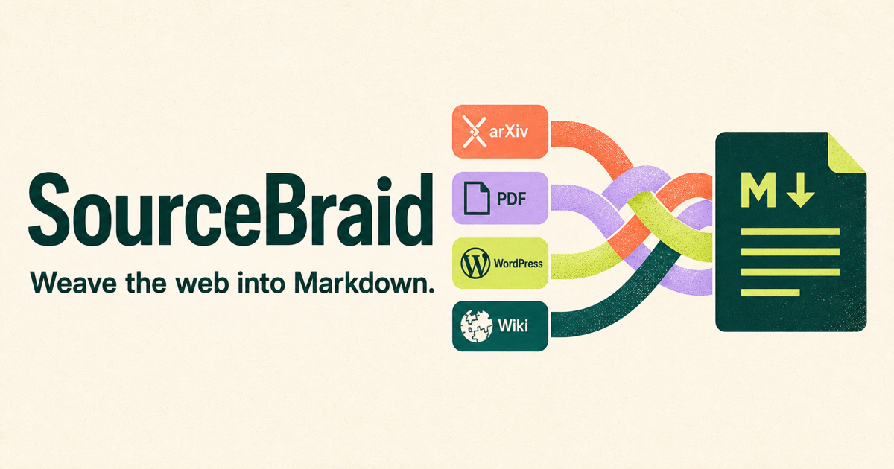
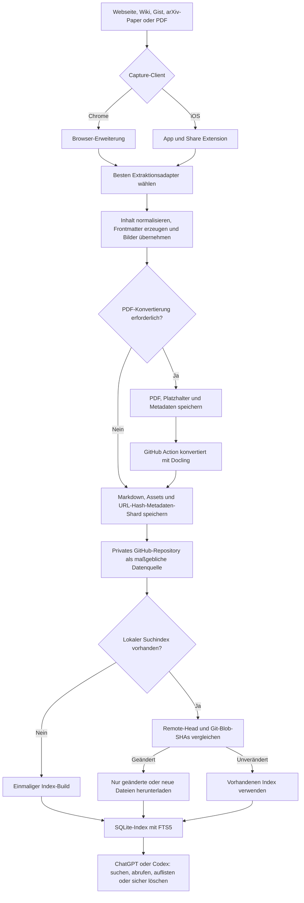

# SourceBraid

**SourceBraid — Weave the web into Markdown.**

[Read this documentation in English](README.md)



[SourceBraid](https://sourcebraid.com) speichert Artikel, wissenschaftliche
Veröffentlichungen, Wiki-Seiten, GitHub Gists und PDF-Dokumente als dauerhaft
lesbares Markdown in einem privaten GitHub-Repository. Metadaten stehen im
YAML-Frontmatter, relevante Bilder werden als lokale Repository-Assets
gespeichert und jede Quelle wird in einen durchsuchbaren Index aufgenommen.

SourceBraid setzt nicht bloß Lesezeichen für URLs. Es bereitet jede Quelle auf
Grundlage der aussagekräftigsten verfügbaren und vertrauenswürdigen Darstellung
auf, bewahrt ihre Provenienz und hinterlässt ganz normale Dateien samt
Git-Historie, die auch ohne SourceBraid nützlich bleiben.

## So funktioniert SourceBraid

SourceBraid verbindet Capture-Clients, ein privates GitHub-Repository als
dauerhaft maßgebliche Datenquelle und ein universelles ChatGPT-/Codex-Plugin für
Abruf und Archivverwaltung. Es gibt keinen zentralen
SourceBraid-Inhaltsserver. Die Chrome-Erweiterung beziehungsweise die iOS-App
liest die ausgewählte Quelle, bereitet sie auf und schreibt das Ergebnis direkt
in das konfigurierte Repository.

Der lokale SQLite-Index ist nur ein jederzeit neu aufbaubarer Such-Cache.
Maßgeblich bleiben die Markdown-Dateien und die Git-Historie.


```mermaid
flowchart TD
    A["Webseite, Wiki, Gist, arXiv-Paper oder PDF"] --> B{"Capture-Client"}
    B -->|Chrome| C["Browser-Erweiterung"]
    B -->|iOS| D["App und Share Extension"]
    C --> E["Besten Extraktionsadapter wählen"]
    D --> E
    E --> F["Inhalt normalisieren, Frontmatter erzeugen und Bilder übernehmen"]
    F --> G{"PDF-Konvertierung erforderlich?"}
    G -->|Nein| H["Markdown, Assets und URL-Hash-Metadaten-Shard speichern"]
    G -->|Ja| I["PDF, Platzhalter und Metadaten speichern"]
    I --> J["GitHub Action konvertiert mit Docling"]
    J --> H
    H --> K["Privates GitHub-Repository als maßgebliche Datenquelle"]
    K --> L{"Lokaler Suchindex vorhanden?"}
    L -->|Nein| M["Einmaliger Index-Build"]
    L -->|Ja| N["Remote-Head und Git-Blob-SHAs vergleichen"]
    N -->|Geändert| O["Nur geänderte oder neue Dateien herunterladen"]
    N -->|Unverändert| P["Vorhandenen Index verwenden"]
    M --> Q["SQLite-Index mit FTS5"]
    O --> Q
    P --> Q
    Q --> R["ChatGPT oder Codex: suchen, abrufen, auflisten oder sicher löschen"]
```

Der Ablauf im Einzelnen:

1. **Erfassen:** Eine Person startet SourceBraid auf der geöffneten Seite oder
   teilt einen Inhalt aus iOS. Tags und eigene Notizen können bereits beim
   Speichern ergänzt werden.
2. **Extrahieren:** SourceBraid wählt den hochwertigsten verfügbaren Adapter.
   Strukturierte Quellen wie arXiv, Azure DevOps, Gists oder native
   Markdown-Endpunkte haben Vorrang vor der allgemeinen DOM-Auslese.
3. **Aufbereiten:** Der Inhalt wird in portables Markdown umgewandelt.
   SourceBraid ergänzt YAML-Frontmatter, löst relative Links auf und speichert
   relevante Bilder neben dem Dokument, damit der Clip auch ohne die
   ursprüngliche Webseite lesbar bleibt.
4. **Versioniert speichern:** Dokument, Assets und Metadateneintrag werden über
   die GitHub Contents API geschrieben. Der Metadateneintrag landet anhand des
   URL-Hashes in einem von bis zu 256 JSONL-Shards. Normale Git-Commits machen
   jede Änderung nachvollziehbar und wiederherstellbar.
5. **PDFs nachbearbeiten:** Falls keine geeignete HTML-Fassung existiert, bleibt
   das Original-PDF im Repository. Eine GitHub Action erzeugt mit Docling das
   endgültige Markdown, extrahiert Abbildungen und ersetzt den zunächst
   angelegten Platzhalter.
6. **Indexieren:** Beim ersten Einsatz baut das Plugin aus dem Repository einen
   lokalen SQLite-FTS5-Index auf. Spätere Aktualisierungen vergleichen den
   gespeicherten Commit und die Git-Blob-SHAs; dadurch werden nur neue,
   geänderte oder gelöschte Dateien verarbeitet.
7. **Verwenden:** ChatGPT oder Codex durchsucht normalerweise den lokalen Index,
   kann Treffer vollständig abrufen und unterstützt eine abgesicherte Löschung
   mit Vorschau und eindeutiger Bestätigung. Ist GitHub vorübergehend nicht
   erreichbar, bleibt der zuletzt synchronisierte Index lesbar.

Die Trennung zwischen GitHub-Archiv und lokalem Such-Cache ist für größere
Sammlungen entscheidend: Auch bei vielen Tausend Dokumenten muss eine normale
Suche nicht alle Markdown-Dateien nacheinander öffnen. Ein vollständiger
Durchlauf ist nur für den ersten Aufbau, einen ausdrücklich angeforderten
Rebuild oder eine Indexreparatur nötig.

## Unterstützte Quellen und Konvertierung

| Quelle oder Format | Bevorzugte Extraktion | Ergebnis in Markdown | Bilder und Anhänge | Fallback |
| --- | --- | --- | --- | --- |
| **arXiv-Paper** | Experimentelle arXiv-HTML-Version des vollständigen Papers | Gliederung, Fließtext, Tabellen, Zitate und LaTeX-Formeln; Autoren, arXiv-ID/-Version, DOI, Fachgebiete und Journalreferenz im Frontmatter | Abbildungen werden in den Asset-Ordner kopiert und relativ verlinkt | PDF herunterladen und mit Docling konvertieren |
| **PDF über HTTP(S) oder lokale Datei** | Original-PDF plus asynchroner Docling-Workflow in GitHub Actions | Lesereihenfolge, Tabellen, OCR-Text und referenzierte Abbildungen; zunächst Status `pending`, danach fertiges Markdown | Original bleibt als `source.pdf` erhalten; extrahierte Abbildungen liegen daneben | Lokale PDFs benötigen in Chrome **Zugriff auf Datei-URLs zulassen**; verschlüsselte oder sitzungsgebundene PDFs werden nicht unterstützt |
| **Azure DevOps Wiki** | Authentifizierte Wiki-REST-API liefert das Quell-Markdown | Azure-Makros werden normalisiert, Mermaid bleibt als `mermaid`-Codeblock erhalten, interne Wiki-Links werden absolut | Geschützte Anhänge werden über den weiterhin authentifizierten Quell-Tab geladen und lokal abgelegt | Gerenderter `.markdown-content`-Bereich, falls die API nicht erreichbar ist |
| **GitHub Gist** | GitHub Gist API, bei privaten Gists mit dem konfigurierten Token | Einzelne Markdown-Datei direkt; mehrere Dateien als Abschnitte; Quellcode in Codeblöcken mit Sprachkennung | Öffentliche Bilder direkt, geschützte GitHub-Bilder über den Gist-Tab mit aktiver GitHub-Sitzung | Die Revision einer revisionsspezifischen URL bleibt erhalten |
| **Natives Markdown** | HTTP-Antwort auf `Accept: text/markdown`, z. B. bei Hashnode oder entsprechend konfigurierten Cloudflare-Seiten | Quell-Frontmatter und doppeltes H1 werden entfernt; relative Links werden absolut | Relevante Bilder werden lokal gespeichert und relativ verlinkt | Danach greifen die spezifischen APIs oder die DOM-Extraktion |
| **WordPress** | WordPress-REST-Endpunkt aus den Seitenmetadaten | Artikelinhalt wird aus der strukturierten API-Antwort konvertiert | Relevante Artikelbilder werden lokal gespeichert | Sichtbarer Seiteninhalt |
| **Forem / DEV** | Forem API mit Quell-Markdown | Markdown wird normalisiert und ohne Oberflächenelemente der Website gespeichert | Relevante Bilder werden lokal gespeichert | Sichtbarer Seiteninhalt |
| **Ghost** | Konfigurierte Ghost Content API | Strukturierter Post-Inhalt; die kanonische URL wird vor der Übernahme geprüft | Relevante Bilder werden lokal gespeichert | Sichtbarer Seiteninhalt |
| **Blogger** | Blogger API anhand erkannter Blog- und Post-IDs | Strukturierter Artikelinhalt | Relevante Bilder werden lokal gespeichert | Sichtbarer Seiteninhalt |
| **Google-DeepMind-Blog** | Artikelsektionen aus dem Seiten-DOM | Vollständiger Beitrag ohne Cover-Bedienelemente und Karten verwandter Beiträge | Artikelbilder werden lokal gespeichert | Allgemeine Extraktion des sichtbaren Seiteninhalts |
| **JSON Feed, RSS oder Atom** | Im HTML angekündigter Feed | Vollständiger Feed-Inhalt, sofern vorhanden | Relevante Bilder werden lokal gespeichert | Sichtbarer Seiteninhalt |
| **Allgemeine HTML-Seite** | Sichtbares DOM, bevorzugt `article`, `main` oder `[role="main"]` | Überschriften, Absätze, Links, Listen, Zitate, Codeblöcke und Tabellen | Inhaltlich relevante Bilder werden lokal gespeichert | `body` als letzte Rückfallstufe |

### Reihenfolge der Erkennung

SourceBraid verwendet immer die inhaltlich hochwertigste verfügbare Quelle. Bei
HTML-Seiten werden die Adapter in dieser Reihenfolge geprüft:

1. arXiv-HTML
2. Azure DevOps Wiki
3. GitHub Gist
4. natives Markdown
5. WordPress REST
6. Forem / DEV API
7. Ghost Content API
8. Blogger API
9. Google-DeepMind-Blog-DOM
10. JSON Feed, RSS oder Atom
11. sichtbares DOM

Die erste passende und validierte Quelle gewinnt. Anschließend normalisiert
SourceBraid das Markdown, lädt Bilder herunter, schreibt das YAML-Frontmatter
und aktualisiert den Index.

## Ablagestruktur

Markdown-Dateien werden über die GitHub Contents API gespeichert:

```text
web-clips/YYYY/MM/YYYY-MM-DD-domain-title-urlhash.md
```

Die zugehörigen Assets liegen unter:

```text
web-clips/YYYY/MM/assets/YYYY-MM-DD-domain-title-urlhash/
```

Links auf gespeicherte Bilder werden im Markdown relativ zu diesem Asset-Ordner
geschrieben. Für PDFs liegt dort zusätzlich das Original als `source.pdf`.

SourceBraid pflegt außerdem einen nach URL-Hash geshardeten Metadatenindex:

```text
web-clips/index/00.jsonl
...
web-clips/index/ff.jsonl
```

Dieselbe URL landet immer im selben Shard. Dadurch muss beim Speichern nicht der
gesamte Metadatenbestand neu geschrieben werden. Bestehende Archive mit
`web-clips/index.jsonl` bleiben kompatibel und können über das Plugin atomar
migriert werden. Jeder Eintrag enthält Titel, kanonische URL, Repository-Pfad,
Erfassungsdatum, optionale Veröffentlichungs- und Änderungsdaten, Tags,
Quellentyp,
Extraktionsmethode, Erfassungszeitpunkt und gespeicherte Bildpfade. `date` und
der Pfad `YYYY/MM` verwenden das lokale Erfassungsdatum; das
Veröffentlichungsdatum der Quelle bleibt separat als `published` erhalten.

## Wissenschaftliche Veröffentlichungen und PDFs

### arXiv direkt als Markdown

Eine arXiv-Abstract-Seite wie `https://arxiv.org/abs/2311.02462` kann direkt
gespeichert werden. SourceBraid lädt bevorzugt die experimentelle HTML-Ausgabe
des vollständigen Papers, konvertiert sie in Markdown und übernimmt
wissenschaftliche Metadaten. Das PDF muss dafür weder manuell heruntergeladen
noch geöffnet werden.

Existiert keine HTML-Ausgabe, lädt die Erweiterung das PDF im Hintergrund in
das Repository hoch. Der Docling-Workflow übernimmt danach automatisch die
Konvertierung.

### Allgemeine PDFs

SourceBraid unterstützt sowohl PDF-URLs über HTTP(S) als auch lokale, in Chrome
geöffnete `.pdf`-Dateien. Für lokale Dateien muss unter `chrome://extensions` in
den Details von SourceBraid einmalig **Zugriff auf Datei-URLs zulassen**
aktiviert sein. Ist die Berechtigung nicht gesetzt, zeigt die Erweiterung eine
konkrete Anleitung an und legt keinen leeren HTML-Clip an.

Bei der Erfassung eines PDFs wird zunächst Folgendes gespeichert:

```text
web-clips/YYYY/MM/assets/CLIP-SLUG/source.pdf
```

Die Erweiterung erstellt vorab einen Markdown-Eintrag mit Status `pending` und
einen Metadateneintrag. Der abschließende PDF-Commit startet
`.github/workflows/convert-pdfs.yml`. Der Workflow:

1. installiert Docling auf einem GitHub-Runner,
2. extrahiert Lesereihenfolge, Tabellen, OCR-Text und Abbildungen,
3. ersetzt den ausstehenden Markdown-Eintrag unter Beibehaltung von Notizen und
   Frontmatter,
4. markiert den passenden Metadateneintrag als abgeschlossen und
5. behält das Original-PDF neben den extrahierten Assets.

GitHub Actions benötigt Schreibzugriff auf Repository-Inhalte. Der Workflow hat
ein Zeitlimit von 45 Minuten; einzelne PDFs sind wegen der Größenbeschränkungen
von Browser und GitHub API auf 25 MB begrenzt. Eine erneute Konvertierung ist
unter **Actions → Convert PDFs to Markdown → Run workflow** möglich.

Wenn während einer laufenden Konvertierung weitere Clips auf demselben Branch
gespeichert werden, aktualisiert der Workflow seinen Branch vor dem Push erneut
und wiederholt einen abgelehnten Push bis zu fünfmal. Dadurch gehen parallele
SourceBraid-Uploads nicht durch einen kurzzeitigen Git-Ref-Konflikt verloren.

## Wikis und Gists mit Bildern

### Azure DevOps Wiki

SourceBraid ruft das Quell-Markdown über die authentifizierte
Azure-DevOps-Wiki-API ab. Falls dies nicht möglich ist, wird ausschließlich der
gerenderte Bereich `.markdown-content` konvertiert – nicht Navigation, Kopfzeile
oder sonstige Azure-DevOps-Oberfläche.

Da geschützte Anhang-URLs die bestehende authentifizierte Browser-Sitzung
benötigen können, lädt SourceBraid die Bilder nacheinander über den geöffneten
Quell-Tab, speichert sie im Asset-Ordner und ersetzt die URLs durch relative
Repository-Pfade. Der Quell-Tab muss deshalb bis zum Abschluss des Speicherns
geöffnet bleiben. Im Frontmatter werden Organisation, Projekt, Wiki-ID,
Seiten-ID, Seitenpfad und – soweit verfügbar – Revision festgehalten.

### GitHub Gists

Bei einem Gist mit nur einer Markdown-Datei wird diese direkt als
Dokumentinhalt übernommen. Gists mit mehreren Dateien werden zu einem Dokument
mit einem Abschnitt je Dateiname zusammengeführt; Nicht-Markdown-Dateien bleiben
als Codeblöcke mit Sprachkennung erhalten.

Öffentliche Gists funktionieren anonym. Für private Gists verwendet SourceBraid
zusätzlich den konfigurierten GitHub-Token, sofern dieser Leserechte für Gists
besitzt. Zugriffsgeschützte GitHub-Bilder können über den weiterhin geöffneten
Gist-Tab mit aktiver GitHub-Sitzung geladen werden.

## Chrome-Installation

1. `chrome://extensions` öffnen.
2. **Entwicklermodus** aktivieren.
3. **Entpackte Erweiterung laden** auswählen.
4. [`chrome-extension/sourcebraid`](chrome-extension/sourcebraid) auswählen.
5. Eine unterstützte Quelle öffnen und auf das **SourceBraid**-Symbol klicken.
6. Das private GitHub-Repository konfigurieren, optional Tags oder Notizen
   ergänzen und **Save to GitHub** wählen.

Nach der ersten Einrichtung bleiben die GitHub-Einstellungen hinter dem
Einstellungssymbol im Popup eingeklappt. Scheitert nur der GitHub-Upload nach
einer erfolgreichen Extraktion, steht im Popup **Download Fallback** zur
Verfügung. Vor dem Upload prüft SourceBraid, ob das konfigurierte Repository
existiert und mit dem Token zugänglich ist; bei `404 Not Found` zeigt das Popup
einen eindeutigen Fehler an.

## GitHub-Token

Verwende ein Fine-grained Personal Access Token, das auf genau ein privates
Repository beschränkt ist:

```text
Contents: Read and write
Workflows: Read and write
```

`Workflows` ist nur für die PDF-Unterstützung erforderlich. Beim ersten
PDF-Upload installiert SourceBraid den mitgelieferten Docling-Workflow, das
Konvertierungsskript und die Requirements-Datei, sofern diese Pfade noch nicht
existieren. Bestehende Dateien werden nicht überschrieben. Der Token wird lokal
im Chrome-Erweiterungsspeicher abgelegt.

Optionale API-Einstellungen:

- Ghost Content API: Basis-URL, zum Beispiel
  `https://example.com/ghost/api/content`, plus browsergeeigneter Content-API-Key
- Blogger: optionaler Google API Key; öffentliche Posts benötigen kein OAuth,
  anonyme API-Aufrufe normalerweise aber einen Key für das Kontingent

## SourceBraid in ChatGPT und Codex

**Export Plugin Config** lädt `sourcebraid-config.json` herunter. Speichere die
Datei unter:

```text
~/.config/sourcebraid/config.json
```

Alternativ lässt sich das Plugin im Terminal konfigurieren:

```bash
python3 codex-plugin/sourcebraid/scripts/sourcebraid.py config \
  --repo-slug OWNER/REPO --branch main --root-folder web-clips
```

Das versionierte Plugin liegt unter `codex-plugin/sourcebraid`. Es verwendet
einen lokalen SQLite-FTS5-Index, lädt nur Dateien herunter, deren Git-Blob-SHAs
sich geändert haben, und unterstützt Suche, Abruf, Auflistung sowie abgesicherte
Löschvorschauen:

```bash
python3 codex-plugin/sourcebraid/scripts/sourcebraid.py index build
python3 codex-plugin/sourcebraid/scripts/sourcebraid.py index update --max-age 900
python3 codex-plugin/sourcebraid/scripts/sourcebraid.py index verify
python3 codex-plugin/sourcebraid/scripts/sourcebraid.py search "dynamic agents" --tag ai
python3 codex-plugin/sourcebraid/scripts/sourcebraid.py list "dynamic agents" --refresh
python3 codex-plugin/sourcebraid/scripts/sourcebraid.py plan-delete \
  --path "web-clips/2026/07/example.md" --json
```

Der Index liegt pro Repository und Branch unter
`~/.cache/sourcebraid/.../search.sqlite3` und wird nicht in Git gespeichert.
Eine Suche prüft höchstens alle 15 Minuten, ob sich der Remote-Head geändert
hat; wenn GitHub nicht erreichbar ist, bleibt der lokale Index nutzbar.
`search --scan` ist ein expliziter Diagnose-Fallback auf Basis von `rg`.

Neue Captures schreiben stabile URL-Hash-Shards wie
`web-clips/index/47.jsonl`. Bestehende Archive bleiben lesbar. Vor der
einmaligen Migration wird eine Vorschau erstellt; anschließend wird die
Migration anhand des unveränderten Branch-Heads bestätigt:

```bash
python3 codex-plugin/sourcebraid/scripts/sourcebraid.py index plan-shards --json
python3 codex-plugin/sourcebraid/scripts/sourcebraid.py index migrate-shards \
  --expected-head HEAD_SHA --confirm-head HEAD_SHA --json
```

Vor einer Löschung zeigt das Plugin genau die betroffene Markdown-Datei, die
vorgesehene Metadatenänderung und die ausschließlich diesem Clip zugehörigen
Assets an und verlangt anschließend eine ausdrückliche Bestätigung. Es
speichert die Änderung als normalen Git-Commit ohne erzwungenes Überschreiben,
sodass sie über die Git-Historie wiederherstellbar bleibt.

Das Plugin umfasst außerdem einen lokalen MCP-Server mit den Standardwerkzeugen
`search` und `fetch` für Codex. Solange der Dienst nicht öffentlich
bereitgestellt ist, benötigt ChatGPT einen privaten Secure MCP Tunnel. Hinweise
zur lokalen Codex-Einrichtung und zum späteren ChatGPT-Endpunkt stehen in
[`docs/CHATGPT_PLUGIN.md`](docs/CHATGPT_PLUGIN.md).

## iOS

Die native iOS-App und Share Extension liegen unter [`ios/`](ios/README.md).
Nach einmaliger Einrichtung von Repository und Token können URLs, ausgewählter
Text, Safari-Artikel, PDFs und andere Dateien über das Teilen-Menü an das
konfigurierte private Archiv gesendet werden.

## Android-Roadmap

Android ist bewusst nicht Teil der ersten Veröffentlichung. Das Feedback aus
der OpenAI-Community entscheidet darüber, ob ein Android-Share-Target der
nächste native Client wird und welche Mitwirkenden oder Testpersonen seine
Entwicklung mitgestalten können.

## Mitwirken und Lizenz

SourceBraid ist vollständig Open Source und wird unter der
[MIT-Lizenz](LICENSE) veröffentlicht.
Hinweise für Beiträge und den DCO-Sign-off stehen in
[CONTRIBUTING.md](CONTRIBUTING.md). Der
[Verhaltenskodex](CODE_OF_CONDUCT.md) regelt die Zusammenarbeit, die
[Security Policy](SECURITY.md) die vertrauliche Meldung von Schwachstellen.
Der [öffentliche Release-Prozess](RELEASING.md) beschreibt Versionierung,
Prüfungen und reproduzierbare Release-Artefakte.
[Datenschutz](PRIVACY.md), [Nutzungsbedingungen](TERMS.md) und der
[Hinweis](NOTICE) dokumentieren den lokalen, vom Benutzer kontrollierten
Datenfluss und die Lizenzgrenzen.

## Technische Hinweise

Der Quellcode der Chrome-Erweiterung liegt unter
[`chrome-extension/sourcebraid`](chrome-extension/sourcebraid). Die Erweiterung
benötigt keinen Build-Schritt und bindet keine Laufzeitkomponenten von
Drittanbietern ein. Docling läuft ausschließlich in der GitHub Action des
Ziel-Repositorys. Die
HTML-Konvertierung erfolgt lokal in der Erweiterung; API- und Bildzugriffe
nutzen je nach Quelle entweder normale HTTP-Anfragen oder die bestehende
authentifizierte Browser-Sitzung.
