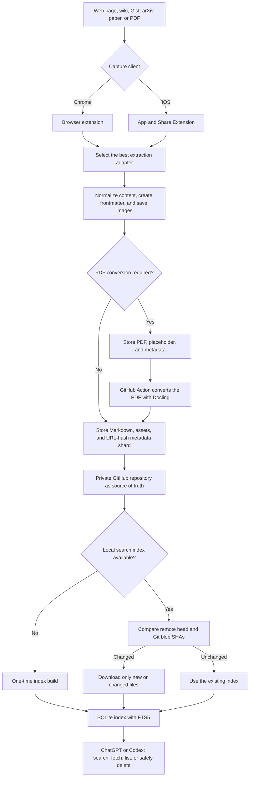

# SourceBraid

**SourceBraid — Weave the web into Markdown.**

[Deutsche Dokumentation](README.de.md)


[SourceBraid](https://sourcebraid.com) saves articles, research papers, wiki
pages, GitHub Gists, and PDF documents as durable Markdown in a private GitHub
repository. Metadata lives in YAML frontmatter, relevant images become local
repository assets, and every source is added to a searchable index.

SourceBraid does more than bookmark URLs. It prepares each source using the
richest trustworthy representation available, keeps its provenance, and leaves
you with ordinary files and Git history that remain useful without SourceBraid.

## How SourceBraid works

SourceBraid combines capture clients, a private GitHub repository as the durable
source of truth, and a universal ChatGPT/Codex plugin for retrieval and archive
management. There is no central SourceBraid content server. The Chrome extension
or iOS app reads and prepares a selected source, then writes the result directly
to the repository configured by the user.

The local SQLite index is only a rebuildable search cache. Markdown files and
Git history remain authoritative.



The workflow in detail:

1. **Capture:** Open SourceBraid on the current page or share content from iOS.
   Add tags and personal notes before saving.
2. **Extract:** SourceBraid selects the strongest available adapter. Structured
   sources such as arXiv, Azure DevOps, Gists, and native Markdown take priority
   over generic DOM extraction.
3. **Prepare:** Content becomes portable Markdown. SourceBraid adds YAML
   frontmatter, resolves relative links, and stores relevant images next to the
   document so the clip remains readable without the original page.
4. **Commit:** Documents, assets, and metadata are written through the GitHub
   Contents API. Metadata is partitioned into up to 256 JSONL shards by URL hash.
   Normal Git commits make every change inspectable and recoverable.
5. **Finish PDFs:** When no suitable HTML representation exists, the original
   PDF remains in the repository. A GitHub Action uses Docling to create the
   final Markdown, extract figures, and replace the pending placeholder.
6. **Index:** On first use, the plugin builds a local SQLite FTS5 index. Later
   updates compare the stored commit and Git blob SHAs, processing only new,
   changed, or deleted files.
7. **Use:** ChatGPT or Codex searches the local index, fetches complete sources,
   and supports guarded deletion with a preview and exact confirmation. If
   GitHub is temporarily unavailable, the last synchronized index remains
   readable.

Keeping the GitHub archive separate from the local search cache matters for
large collections: a normal query does not need to reopen thousands of Markdown
files. A full pass is needed only for the first build, an explicit rebuild, or
index repair.

## Supported sources and conversion

| Source or format | Preferred extraction | Markdown result | Images and attachments | Fallback |
| --- | --- | --- | --- | --- |
| **arXiv paper** | Experimental full-paper arXiv HTML | Sections, prose, tables, citations, and LaTeX formulas; authors, arXiv ID/version, DOI, categories, and journal reference in frontmatter | Figures are copied into the asset folder and linked relatively | Download the PDF and convert it with Docling |
| **Remote or local PDF** | Original PDF plus asynchronous Docling workflow in GitHub Actions | Reading order, tables, OCR text, and referenced figures; starts as `pending`, then becomes finished Markdown | The original remains as `source.pdf`; extracted figures sit beside it | Local PDFs require Chrome's **Allow access to file URLs** setting; encrypted or session-only PDFs are unsupported |
| **Azure DevOps Wiki** | Authenticated Wiki REST API returns source Markdown | Azure macros are normalized, Mermaid remains a `mermaid` code block, internal wiki links become absolute | Protected attachments are loaded through the still-authenticated source tab | Rendered `.markdown-content` area |
| **GitHub Gist** | GitHub Gist API, with the configured token for private Gists | A single Markdown file directly; multiple files as sections; source code in language-tagged fences | Public images directly, protected GitHub images through the signed-in Gist tab | Revision-specific URLs keep their revision |
| **Native Markdown** | HTTP response to `Accept: text/markdown` | Source frontmatter and duplicate H1 removed; relative links made absolute | Relevant images are stored locally and linked relatively | Continue through dedicated APIs, then DOM extraction |
| **WordPress** | WordPress REST endpoint discovered from page metadata | Article content converted from structured API data | Relevant article images stored locally | Visible page content |
| **Forem / DEV** | Forem API with source Markdown | Normalized Markdown without site chrome | Relevant images stored locally | Visible page content |
| **Ghost** | Configured Ghost Content API | Structured post content with canonical URL validation | Relevant images stored locally | Visible page content |
| **Blogger** | Blogger API using detected blog and post IDs | Structured article content | Relevant images stored locally | Visible page content |
| **JSON Feed, RSS, or Atom** | Feed announced by the HTML page | Full feed content when available | Relevant images stored locally | Visible page content |
| **Generic HTML page** | Visible DOM, preferring `article`, `main`, or `[role="main"]` | Headings, paragraphs, links, lists, quotes, code, and tables | Content-relevant images stored locally | `body` as the final fallback |

### Detection order

SourceBraid always uses the strongest available content source. For HTML pages,
adapters run in this order:

1. arXiv HTML
2. Azure DevOps Wiki
3. GitHub Gist
4. Native Markdown
5. WordPress REST
6. Forem / DEV API
7. Ghost Content API
8. Blogger API
9. JSON Feed, RSS, or Atom
10. Visible DOM

The first matching, validated source wins. SourceBraid then normalizes the
Markdown, downloads images, writes YAML frontmatter, and updates the index.

## Archive layout

Markdown files are stored through the GitHub Contents API:

```text
web-clips/YYYY/MM/YYYY-MM-DD-domain-title-urlhash.md
```

Related assets live under:

```text
web-clips/YYYY/MM/assets/YYYY-MM-DD-domain-title-urlhash/
```

Markdown image references are relative to this asset directory. PDF sources
also retain the original as `source.pdf`.

SourceBraid maintains a URL-hash-sharded metadata index:

```text
web-clips/index/00.jsonl
...
web-clips/index/ff.jsonl
```

The same URL always maps to the same shard, avoiding a rewrite of the entire
metadata collection on each capture. Existing archives with
`web-clips/index.jsonl` remain compatible and can be migrated atomically through
the plugin. Each entry includes title, canonical URL, repository path, capture
date, optional publication and modification dates, tags, source type,
extraction method, capture timestamp, and saved image paths.

## Research papers and PDFs

### arXiv directly to Markdown

An arXiv abstract page such as `https://arxiv.org/abs/2311.02462` can be saved
directly. SourceBraid prefers the experimental HTML version of the full paper,
converts it to Markdown, and keeps research metadata. The PDF does not need to
be downloaded or opened manually.

If no HTML version exists, the extension uploads the PDF in the background and
the Docling workflow converts it automatically.

### General PDFs

SourceBraid accepts remote HTTP(S) PDFs and local `.pdf` files opened in Chrome.
For local files, enable **Allow access to file URLs** in SourceBraid's extension
details at `chrome://extensions`. Without that permission, the extension shows
a concrete instruction instead of producing an empty HTML clip.

A PDF capture initially stores:

```text
web-clips/YYYY/MM/assets/CLIP-SLUG/source.pdf
```

The extension creates a pending Markdown entry and metadata record. The final
PDF commit starts `.github/workflows/convert-pdfs.yml`, which:

1. installs Docling on a GitHub runner;
2. extracts reading order, tables, OCR text, and figures;
3. replaces the pending Markdown while preserving notes and frontmatter;
4. marks the matching metadata entry as complete; and
5. retains the original PDF beside extracted assets.

GitHub Actions needs write access to repository contents. The workflow has a
45-minute timeout, and individual PDFs are limited to 25 MB by browser and
GitHub API constraints. Rerun a conversion under **Actions → Convert PDFs to
Markdown → Run workflow**.

If another clip is saved to the same branch during conversion, the workflow
refreshes its branch and retries a rejected push up to five times. Concurrent
SourceBraid uploads are therefore not lost to a temporary Git ref race.

## Wikis and Gists with images

### Azure DevOps Wiki

SourceBraid reads source Markdown through the authenticated Azure DevOps Wiki
API. If that fails, it converts only the rendered `.markdown-content` area —
not navigation, headers, or unrelated Azure DevOps UI.

Protected attachment URLs may need the browser's signed-in session, so
SourceBraid loads images sequentially through the open source tab, stores them
in the asset folder, and rewrites links to relative repository paths. Keep the
source tab open until capture completes.

### GitHub Gists

A one-file Markdown Gist becomes the document body directly. Multi-file Gists
become one document with a section per filename; non-Markdown files remain in
language-tagged code fences.

Public Gists work anonymously. For private Gists, SourceBraid uses the configured
GitHub token when it has Gist read permission. Signed-in GitHub image assets can
be loaded through the still-open Gist tab.

## Chrome installation

1. Open `chrome://extensions`.
2. Enable **Developer mode**.
3. Select **Load unpacked**.
4. Choose this repository folder.
5. Open a supported source and select the **SourceBraid** icon.
6. Configure the private GitHub repository, optionally add tags or notes, and
   choose **Save to GitHub**.

After setup, GitHub settings stay collapsed behind the settings icon. If only
the GitHub upload fails after successful extraction, the popup offers a
**Download Fallback**.

## GitHub token

Use a fine-grained personal access token restricted to exactly one private
repository:

```text
Contents: Read and write
Workflows: Read and write
```

`Workflows` is needed only for PDF support. On the first PDF upload, SourceBraid
installs the bundled Docling workflow, conversion script, and requirements file
when those paths do not already exist. Existing files are never overwritten.
The token is stored locally in Chrome extension storage.

Optional API configuration:

- Ghost Content API: base URL plus a browser-safe Content API key
- Blogger: optional Google API key for anonymous public API quota

## SourceBraid in ChatGPT and Codex

**Export Plugin Config** downloads `sourcebraid-config.json`. Store it at:

```text
~/.config/sourcebraid/config.json
```

Or configure the plugin in a terminal:

```bash
python3 codex-plugin/sourcebraid/scripts/sourcebraid.py config \
  --repo-slug OWNER/REPO --branch main --root-folder web-clips
```

The versioned plugin lives under `codex-plugin/sourcebraid`. It uses a local
SQLite FTS5 index, downloads only files whose Git blob SHAs changed, and
supports search, fetch, listing, and guarded deletion previews:

```bash
python3 codex-plugin/sourcebraid/scripts/sourcebraid.py index build
python3 codex-plugin/sourcebraid/scripts/sourcebraid.py index update --max-age 900
python3 codex-plugin/sourcebraid/scripts/sourcebraid.py index verify
python3 codex-plugin/sourcebraid/scripts/sourcebraid.py search "dynamic agents" --tag ai
python3 codex-plugin/sourcebraid/scripts/sourcebraid.py list "dynamic agents" --refresh
python3 codex-plugin/sourcebraid/scripts/sourcebraid.py plan-delete \
  --path "web-clips/2026/07/example.md" --json
```

The index is stored per repository and branch under
`~/.cache/sourcebraid/.../search.sqlite3` and is never committed. Search checks
for a changed remote head at most every 15 minutes; when GitHub is unavailable,
the local index remains usable. `search --scan` is an explicit `rg` diagnostic
fallback.

New captures write stable URL-hash shards such as
`web-clips/index/47.jsonl`. Legacy archives remain readable. Preview and confirm
the one-time migration against an unchanged branch head:

```bash
python3 codex-plugin/sourcebraid/scripts/sourcebraid.py index plan-shards --json
python3 codex-plugin/sourcebraid/scripts/sourcebraid.py index migrate-shards \
  --expected-head HEAD_SHA --confirm-head HEAD_SHA --json
```

Before deletion, the plugin shows the exact Markdown file, metadata change, and
owned assets, then requires explicit confirmation. It writes a normal,
non-forced Git commit, so repository history remains recoverable.

The plugin also includes a local MCP server with standard `search` and `fetch`
tools, enabling the same installation in ChatGPT and Codex. See
[`docs/CHATGPT_PLUGIN.md`](docs/CHATGPT_PLUGIN.md) for local setup and the future
public HTTPS endpoint.

## iOS

The native iOS app and Share Extension live under [`ios/`](ios/README.md).
After one-time repository and token setup, URLs, selected text, Safari articles,
PDFs, and other files can be sent to the configured private archive through the
system share sheet.

## Android roadmap

Android is intentionally not part of the first release. Feedback from the
OpenAI community will determine whether an Android share target becomes the
next native client and which contributors or testers can help shape it.

## Contributing and license

SourceBraid is fully open source under the [MIT License](LICENSE). See
[CONTRIBUTING.md](CONTRIBUTING.md) for contribution guidance. The
[privacy notice](PRIVACY.md) and [terms](TERMS.md) document the local,
user-controlled data flow.

## Technical notes

The Chrome extension has no build step and bundles no third-party runtime.
Docling runs only inside the target repository's GitHub Action. HTML conversion
happens locally in the extension; API and image requests use either ordinary
HTTP or the browser's existing authenticated session, depending on the source.
